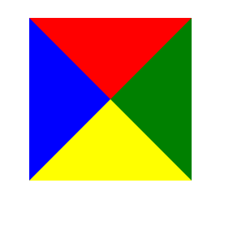
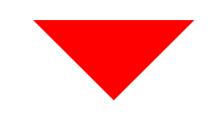

## 步骤：
1. 设置宽度、高度为0的一个div盒子；

2. 为了方便理解，将盒子的4个边框分别设置一样的宽度border，不同的颜色；
``` css
width: 0px;
height: 0px;
border-top: 100px solid red;
border-right: 100px solid green;
border-bottom: 100px solid yellow;
border-left: 100px solid blue;
```

 3. 上图是四个三角形，如果我们只需要其中一个三角形，要做的就是用transparent将其他三个边框隐藏掉，就能看到效果了；
``` css
border-top: 100px solid red;
border-right: 100px solid transparent;
border-bottom: 100px solid transparent;
border-left: 100px solid transparent;
```

这样就得到一个底边朝上的三角形

如果对三角形的样式有特殊的要求，可以通过动画效果来实现，例如用transform：rotate 来实现旋转